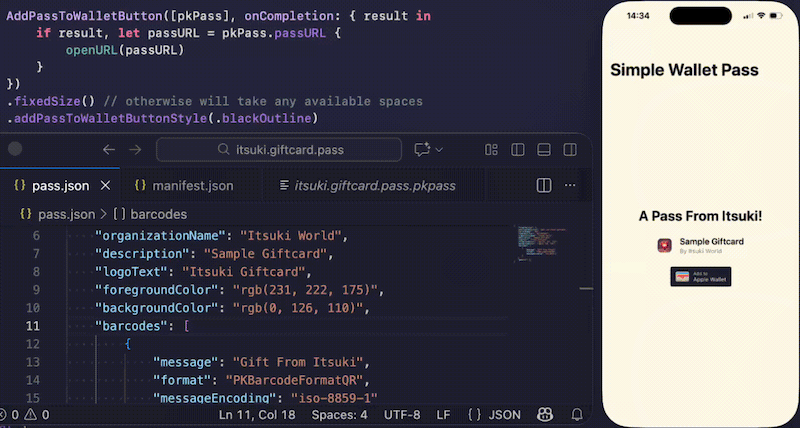
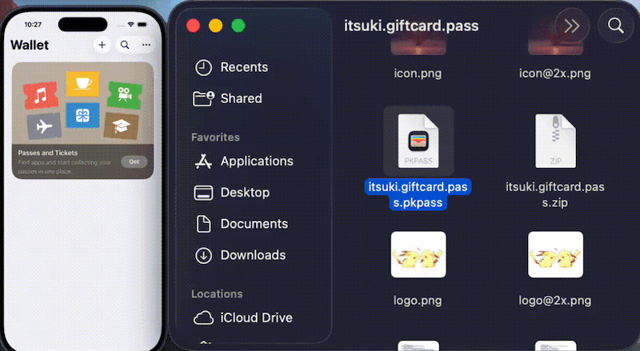

# SwiftUI: Wallet Pass Demo (Static)

A demo of creating a wallet pass (static, ahead of time) and distribute it with an App.

For more details, please refer to my article [Create An Apple Wallet Pass and Make An App To Distribute it]()

## Demo



## Create Wallet Pass

[`itsuki.giftcard.pass`]() contains the source files needed to generate the pass.

1. Replace the `<TeamID>` placeholder in `pass.json` with that of yours. You might also want to change the `passTypeIdentifier` based on your needs.
2. Update `manifest.json`. Specifically, replace the <SHA1 of pass.json> with the SHA1 hash for the `pass.json` file

    ```bash
    openssl sha1 pass.json
    ```

3. Create a PKCS #7 detached signature for the `manifest.json`
    - [Register the pass type identifier](https://developer.apple.com/documentation/walletpasses/building-a-pass#Create-a-Pass-Type-Identifier) specified the `pass.json` in the Certificates, Identifiers & Profiles area of the Apple Developer account
    - [Create a certificate signing request (CSR)](https://developer.apple.com/help/account/create-certificates/create-a-certificate-signing-request)
    - [Generate the signing certificate (.cer)](https://developer.apple.com/documentation/walletpasses/building-a-pass#Generate-a-Signing-Certificate) in the Certificates, Identifiers & Profiles area of the Apple Developer account
    - Download the certificate and Export the it as `.p12` using Keychain Access
    - Create the `pem` files for pass certificate and the private key
    
    ```bash
    # certificate pem
    openssl pkcs12 -in Certificates.p12 -legacy -clcerts -nokeys -out pass_cert.pem -passin pass:

    # private key pem
    # Replace the <YourPassword> placeholder with the one you have specified while exporting the certificate.
    openssl pkcs12 -in Certificates.p12 -legacy -nocerts -out pass_key.pem -passin pass: -passout pass:<YourPassword>
    ```

    - Export [WWDR Intermediate certificate](https://www.apple.com/certificateauthority) as `pem`
        - You should already have it in the keychain, if not, downloaded it from [Apple's site](https://www.apple.com/certificateauthority)
    - Sign the manifest to create the signature file
    
    ```bash
    # 1. Replace the <YourPassword> placeholder with the one you have specified while exporting the certificate.
    # 2. Change the path to the pem files accordingly.
    openssl smime -binary -sign -certfile ../WWDR.pem -signer ../pass_cert.pem -inkey ../pass_key.pem -in manifest.json -out signature -outform DER -passin pass:<YourPassword>
    ```
    
4. Zip the `itsuki.giftcard.pass` directory and change the extension from `zip` to `pkpass`.

```bash
zip -r itsuki.giftcard.pass.pkpass pass.json thumbnail.png thumbnail@2x.png icon.png icon@2x.png logo.png logo@2x.png signature manifest.json
```
 
To test whether the pass is created successfully, simply drag the `itsuki.giftcard.pass.pkpass` into a simulator and if it is indeed in the correct format, we will see it open up in the Wallet app.



For more details on individual steps, please refer to my article [Create An Apple Wallet Pass and Make An App To Distribute it]()


## Run the App

1. Copy the `itsuki.giftcard.pass.pkpass` into the App bundle
2. Run the app on a **Real Device**
    - Simulators won't add the pass to the wallet correctly
    

